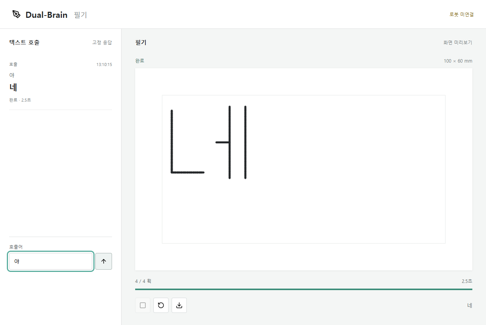
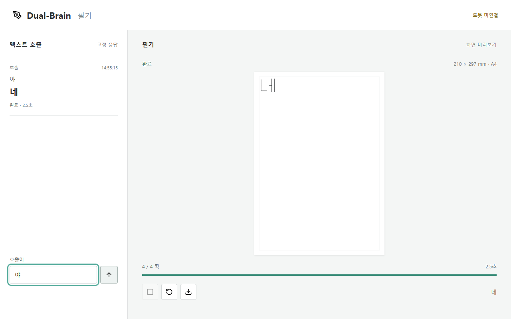

# 한글 붓펜 응답 로봇 개발 기록

최초 작성: **2026-10-07**. 최종 갱신: **2026-10-07**. 모든 날짜는 한국 시간(KST).

**한국어로 질문하면, 질문에 맞는 한글 답변 한 문장을 SO-101이 붓펜으로 쓴다.**
사용자 발화를 그대로 받아쓰는 기능이 아니라 질문에 답하는 시스템이다.
첫 버전은 사람이 펜과 종이를 준비하고, 고정 환경에서 큰 글씨를 천천히 쓴다.

| 구분 | 2026-10-07 현재 상태 |
| --- | --- |
| 개발 브랜치 | `codex/korean-brushpen-response` |
| 현재 마일스톤 | **M0 진행 중: 오프라인 구현 완료, 사용자 가독성 검수 남음** |
| 검증된 결과 | Python 자동 테스트 **19/19 통과**, 데스크톱·모바일 A4 UI 검사 통과 |
| 종이 설정 | **A4 세로형 210×297mm**, 여백 8mm, 호출 응답 글자 크기 28mm |
| 호출 응답 | **텍스트 `야` -> 고정 응답 `네` -> 화면 필기**, 구현·자동 검증 완료 |
| 한글 검사 범위 | 현대 한글 **11,172개 음절의 좌표 유한값·범위 검사** |
| 장비 조건 | 로봇 미연결, 실물 장착·보정은 다시 진행해야 함 |
| 펜·장착 방향 | 모나미 일반 붓펜 후보, 몸통 중간쯤 직접 파지, 종이에 수직 목표 |
| 실측 대기 | 제품 식별, 파지 위치·지름, 펜 끝 위치·방향, 접촉 조건·작업영역 |
| 다음 행동 | 호출 응답·대표 글자 사용자 검수, 다음 단계 개발은 별도 승인 후 착수 |
| 미검증 영역 | 실물 가독성·필압·반복 성공률·속도, 필기용 로봇 시뮬레이션 |
| 미구현 기능 | 실제 질문별 AI 답변, Windows 음성 인식, 실물 필기 실행 |

좌표 검사 통과는 실제 글자를 읽을 수 있다는 증거가 아니다. 화면 검수와 실물
시험을 따로 기록하며, 계획만 세운 단계는 완료 처리하지 않는다.

## 문서 바로가기

| 문서 | 확인할 내용 |
| --- | --- |
| [붓펜·장착 계획](pen-mounting.md) | 제품 규격, 장착 방향, 실측 대기 항목, X 영상과의 차이 |
| [전체 로드맵](../brushpen-response-roadmap.md) | M0~M10의 선행 조건·체크리스트·통과 기준 |
| [실행 안내](../robot-writing.md) | 로컬 앱 실행, 경로 출력, 좌표와 안전 계약 |

## 진행 순서

```text
로봇 없이: M0 미리보기 -> M1 로봇 시뮬레이션 + M2 실행 관리
장비 준비: M3 보정 -> M4 공중/선 -> M5 큰 글자 -> M6 고정 문장 10회
필기 검증: M7 AI 답변 -> M8 음성 인식 -> M9 전체 응답 -> M10 여러 문장
```

**M6은 AI·음성 통합의 선행 관문이다.** 글씨가 읽히지 않으면 모델 강화보다
펜 장착, 보정, 접촉과 획 형상을 먼저 수정한다.

## 마일스톤 대시보드

착수일은 실제 구현·검수를 시작한 날짜, 완료일은 통과 기준까지 확인한 날짜다.
`미완료`는 아직 완료일이 없다는 뜻이다. 계획을 정한 날짜를 착수일로 대신하지 않는다.

| 단계 | 목표 | 상태 | 착수일 | 완료일 | 결과와 증거 |
| --- | --- | --- | --- | --- | --- |
| M0 | 한글 획·배치·미리보기 검수 | **진행 중** | 2026-10-07 | 미완료 | [초기 구현](#2026-10-07-초기-구현과-검증), [호출 응답 화면](#2026-10-07-텍스트-호출-응답-화면) |
| M1 | 펜 끝 IK와 로봇 시뮬레이션 | 미시작 | 미착수 | 미완료 | 없음 |
| M2 | 실행 관리·중지·시험 기록 | 화면 제어 부분 구현 | 2026-10-07 | 미완료 | 화면 중복 방지·중지·오류·JSON 출력, 실행기 기록은 남음 |
| M3 | 실물 연결·장착·보정 | 장비 대기 | 미착수 | 미완료 | 없음 |
| M4 | 공중 이동·접촉·선 시험 | 대기 | 미착수 | 미완료 | 없음 |
| M5 | `가`, `한`, `글` 각각 10회 | 대기 | 미착수 | 미완료 | 없음 |
| **M6** | **같은 문장 10회, 정답 비공개 판독** | **대기** | 미착수 | 미완료 | 없음 |
| M7 | 질문별 AI 답변 필기 | M6 전 보류 | 미착수 | 미완료 | 없음 |
| M8 | Windows 한국어 음성 인식 | M7 이후 | 미착수 | 미완료 | 없음 |
| M9 | 음성 질문부터 필기까지 평가 | M8 이후 | 미착수 | 미완료 | 없음 |
| M10 | 여러 문장과 공간 관리 | M9 전 보류 | 미착수 | 미완료 | 없음 |

세부 체크리스트와 통과 기준은 [개발 로드맵](../brushpen-response-roadmap.md)에 있다.
반복 시험 기준인 9/10, 전체 평가 기준인 18/20은 개발 목표이지 달성 성과가 아니다.

## 날짜별 기록

과거 기록은 당시의 판단으로 보존한다. 이후 변경은 새 날짜의 기록에 이유와 함께
추가하고, 위 대시보드와 최종 갱신일을 최신 상태로 갱신한다.

| 날짜 | 단계 | 작업 | 결과 | 다음 작업 |
| --- | --- | --- | --- | --- |
| 2026-10-07 | 계획 | 첫 목표, 범위, 물리적 필기 선행 관문 확정 | M0~M10 정의, 실물 검증과 소프트웨어 검증 분리 | M0 가독성 검수 |
| 2026-10-07 | M0 | 오프라인 획·배치·출력 구현 및 재시험 | 자동 테스트 8/8, 사용자 검수는 남음 | 대표 글자 검수 자료 준비 |
| 2026-10-07 | 기록 | 날짜와 마일스톤 README 최초 게시 | [3af0370](https://github.com/LDY-01/dual-brain/commit/3af0370) 개발 브랜치 푸시 완료 | 개발은 사용자 지시에 따라 재개 |
| 2026-10-07 | M0 | 대표 글자 검수 자료 생성 | 5종 PNG/SVG/JSON 출력, 사람 검수 대기 | 대표 글자 가독성 검수 |
| 2026-10-07 | M0 / M2 일부 | 사용자의 개발 재개 지시 후 텍스트 호출 화면 구현 | Python 18/18, 두 화면 크기 UI 검사 통과 | 사용자 검수와 시뮬레이션 |
| 2026-10-07 | M0 | 사용자 지정 A4 용지 크기 반영 | Python 재검사 19/19, A4 비율·JSON·데스크톱/모바일 검사 통과 | A4 필기 가독성 검수 |
| 2026-10-07 | 장착 계획 | 붓펜 공식 규격 조사와 사용자 장착 방향 정리 | 직접 파지 우선·보강 대안·수직 목표, 실측값과 명목 규격 분리 | M1은 별도 승인 후 착수, M3는 장비 대기 |
| 2026-10-07 | 기록·게시 | 사용자 요청에 따라 현재 단계와 장착 계획을 개발 브랜치에 게시 | 기존 호출 화면·A4 코드·테스트·검수 이미지와 최신 문서 포함 | 다음 단계 개발은 시작하지 않음 |

### 2026-10-07 초기 구현과 검증

**문제:** 장비를 당장 연결할 수 없다. 따라서 로봇 통신, 카메라, 음성 모델이나
LLM 없이도 검증 가능한 한글 필기 경로 생성기를 먼저 만든다.

**구현:** Unicode 정규화, 현대 한글 자모 조합, 중심선 획 생성, 종이 기준 mm 배치,
줄바꿈, 여백·지원 문자 검사, 펜 올림/내림을 분리한 작업 데이터를 추가했다.
출력은 PNG, SVG, 획 순서 애니메이션과 JSON이다.

| 검증 항목 | 결과 | 의미와 한계 |
| --- | --- | --- |
| 자동 테스트 재실행 | 8/8 통과 | 오프라인 데이터와 출력 계약 확인 |
| 현대 한글 좌표 검사 | 11,172개 음절 검사 통과 | 유한값·정규화 범위 확인, 글자별 가독성 평가는 아님 |
| 예문 미리보기 | `오늘은 어떤 일을 도와드릴까요?` 출력 | 직접 입력한 고정 문장, AI 응답 아님 |
| 펜 상태와 안전 계약 | 획 사이 펜 올림, 실행 미허가 데이터 확인 | 실제 모터 명령과 실행기는 없음 |
| 사람의 가독성 검수 | 미완료 | M0 완료 전에 대표 글자·문장 확인 필요 |
| 실물 시험 | 0회 | 실제 필압·가독성·반복 성공률 주장 불가 |

**설계 판단:** LLM은 답변 내용을 만들고 필기 실행기는 검증된 글자 획을 재사용한다.
기존 ACT 픽앤플레이스 정책을 필기에 그대로 쓰거나 재학습했다고 취급하지 않는다.
종이의 `z=0`은 가상 기준이며 물리 접촉 높이가 아니다. 모든 계획은
`motion_authorized=false`, `physical_calibration_required=true`를 유지한다.

**관련 코드와 테스트:**

- [획 라이브러리](../../kwon_lab/writing/strokes.py)
- [배치와 계획](../../kwon_lab/writing/planner.py)
- [출력과 미리보기](../../kwon_lab/writing/preview.py)
- [실행 도구](../../kwon_lab/tools/writing_preview.py)
- [테스트](../../tests/test_writing.py)

**재현 명령:** 저장소 루트의 PowerShell에서 실행한다.

```powershell
& '.\.venv\Scripts\python.exe' -X utf8 -m unittest discover -s tests -v
& '.\.venv\Scripts\python.exe' -X utf8 kwon_lab/tools/writing_preview.py `
  --text '오늘은 어떤 일을 도와드릴까요?' `
  --output outputs/writing/first_sentence
```

기존 로컬 가상환경을 사용한 명령이다. `.venv` 자체는 저장소에 포함하지 않는다.
기본 경로 생성에는 표준 라이브러리, PNG 출력에는 Pillow가 필요하다.
대량 산출물은 비추적 `outputs/`에 보관하고 검수용 소형 증거만 문서에 선별한다.

**남은 일:** 대표 글자·복합 모음·받침·문장을 검수하고, 읽기 어려운 획을 수정한다.
그다음 펜 끝 기준 시뮬레이션 M1과 고정 텍스트 실행 관리 M2로 진행한다.

### 2026-10-07 텍스트 호출 응답 화면

**첫 소프트웨어 목표:** 입력창에 `야`를 보내면 고정 응답 `네`의 필기 계획을 생성하고
화면에 획 순서대로 쓴 뒤 다음 입력을 받는다. 호출 응답 구현과 자동 검증은 끝났지만
사용자 가독성 판정 전이므로 M0 전체는 진행 중이다.

**구현:** Python 표준 라이브러리의 루프백 HTTP 서버, 고정 호출 처리, 기존 획
생성기를 재사용한 Canvas 필기 화면을 추가했다. 기다림·계획·쓰기·완료·중지·실패를
구분하고 입력 중복 차단, 다시 쓰기와 계획/결과 JSON 내려받기를 연결했다.
KST 생성 시각과 작업 ID, 실행 미허가 플래그를 JSON에 유지한다.

이 단계는 AI 대화가 아니다. `야`만 지원하며 랜덤 질문에는 명시적인 오류를 표시한다.
음성·마이크·카메라·모터 접근과 외부 모델 요청은 없다. 아이콘도 로컬에 포함한다.
호출 기록은 현재 탭의 최근 30개이며 새로고침하면 사라진다. 필요할 때 JSON을
내려받는 구성으로, 서버의 영구 실행 기록과 탭 간 작업 잠금은 아직 없다.



[모바일 화면 증거](assets/2026-10-07-text-call-mobile.png).
이미지는 화면 필기 미리보기이며 실제 로봇 필기 사진이 아니다.

| 검증 | 결과와 범위 |
| --- | --- |
| Python 단위·HTTP 검사 | **18/18 통과**, 기존 8개 + 검수 자료 2개 + 호출/API 8개 |
| 데스크톱 1280×800 | 완료·중복 차단·중지/재시도·오류·다운로드·아이콘·레이아웃 통과 |
| 모바일 390×844 | 같은 동작 검사와 가로 넘침 검사 통과 |
| 캔버스 검사 | 호출 전 잉크 픽셀 없음, 완료 후 실제 획 픽셀 존재 |
| 중지와 늦은 응답 | 중지 뒤 획이 추가되지 않고 이전 요청이 새 작업을 덮지 않음 |
| 미지원 질문·연결 실패 | 오류 표시, 가짜 답변이나 부분 필기 없음 |
| 안전 계약 | `motion_authorized=false`, `physical_calibration_required=true` 유지 |
| 물리적 필기 | 0회, 실제 속도·필압·가독성·성공률 미측정 |

화면 시험에서 약 2.5초가 표시됐지만 화면 애니메이션 시간일 뿐 실제 로봇 속도가 아니다.
최초 화면의 종이는 100×60mm였고 글자는 28mm였다. 아래 A4 변경 전의 기록으로,
실제 도달영역 검증값이 아니다.
M2의 화면 제어 일부를 선행 구현했지만 전체 실행기·기록·검증 계약은 미완료다.

**실행:** 저장소 루트의 PowerShell에서 실행한다. 추가 Python 패키지는 필요 없다.

```powershell
& '.\.venv\Scripts\python.exe' -X utf8 kwon_lab/tools/writing_chat.py --port 8765
& '.\.venv\Scripts\python.exe' -X utf8 -m unittest discover -s tests -v
```

접속은 `http://127.0.0.1:8765`이며 포트가 사용 중이면 다른 `--port`를 선택한다.
서버는 127.0.0.1에만 열고 다른 사이트의 Origin과 비로컬 Host, 허용하지 않은
파일 경로를 거부한다. 연구용 로컬 서버이며 외부 공개나 실물 제어 서버가 아니다.

**재현 가능한 UI 검사:** Node.js와 Playwright 및 설치된 Edge가 필요하다.
`node tests/writing_chat_ui.cjs`를 실행하고, 다른 포트를 쓰면 `WRITING_TEST_URL`을
해당 주소로 설정한다. 실행 환경에서 Playwright 패키지 경로를 찾을 수 있어야 한다.
원시 화면 증거는 `outputs/writing/chat-ui-tests/`에 저장한다.

**관련 파일:** [호출 처리](../../kwon_lab/writing/call_response.py),
[로컬 서버](../../kwon_lab/writing/web_server.py),
[실행 도구](../../kwon_lab/tools/writing_chat.py),
[화면](../../kwon_lab/writing/web/index.html),
[Python 검사](../../tests/test_writing_chat.py),
[UI 검사](../../tests/writing_chat_ui.cjs).

**다음 검수:** 사용자가 `야`를 보내 `네`가 읽히는지 확인하고 대표 글자 5종도 검수한다.
판독이 어려운 획을 수정한 뒤 M0 완료를 결정한다. 이번 개발 결과는 로컬 변경으로
기록하며, 최초 게시 커밋과 구분한다. 이번 작업에서는 추가 커밋·푸시를 하지 않는다.

### 2026-10-07 A4 용지 크기 반영

**요청:** 실제 사용할 종이를 A4로 확정했다. 방향은 세로형으로 설정했다.

**변경:** 계획의 기본 종이를 210×297mm로 통일하고 CLI·호출 응답·검수 샘플에
반영했다. 화면의 종이 비율과 표시를 A4로 바꾸고, 좌표·여백·캔버스 크기는 계획의
종이 데이터로 계산한다. 호출 응답 글자 28mm, 여백 8mm와 획 순서는 유지했다.
같은 글자가 A4 전체에서 차지하는 실제 상대 크기를 표시하므로 이전 작은 종이
미리보기보다 화면의 글자가 작게 보이는 것이 정상이다.

**검증:** A4 기본값 회귀 검사를 추가했고 재실행에서 Python 19/19가 통과했다.
첫 실행에는 기존 과대 HTTP 요청 오류 검사에서 Windows 연결 중단 오류
`WinError 10053`이 1회 발생했다. 서버 코드는 변경하지 않았으며 재실행에서는
모두 통과했으므로 일시적인 연결 실패 가능성을 남긴다.
데스크톱 1280×800과 모바일 390×844에서 A4 표시·210:297 비율·다운로드 JSON의
210×297mm·잉크 픽셀과 기존 중지/재시도 동작을 검증했다.



[A4 모바일 화면](assets/2026-10-07-a4-mobile.png).
원시 화면 산출물은 새 시험으로 갱신했지만 위 최초 구현 증거는 별도 파일로 보존했다.

**한계:** A4 전체가 물리적으로 도달 가능하다는 뜻은 아니다. 실물 연결 시 M3에서
펜 자세와 실제 필기 영역을 보정하고, 종이 안에 있어도 도달할 수 없는 경로는
거부해야 한다. 가독성 사용자 검수는 아직 미완료다. 변경은 로컬에만 남긴다.

### 2026-10-07 붓펜 선택과 장착 방향 기록·게시

**사용자 계획:** 사진의 모나미 태자용·굵은 붓펜을 후보로 사용한다. 그리퍼가
몸통 중간쯤을 직접 잡고, 불안정하면 테이프 등의 보조 고정을 사용한다.
펜 축은 종이와 수직을 목표로 하지만 정확한 잡는 위치·그리퍼 기준 각도는 미정이다.

**조사와 판단:** 공식 카탈로그의 일반 붓펜 외형은 길이 170.5mm, 폭 12.5mm다.
닫힌 외형의 명목 규격이며 실제 제품 식별·파지 부위 지름·붓끝 위치는 별도 확인한다.
X 영상의 거의 수직인 붓 자세는 참고하지만 정확한 장착 수치는 복사할 수 없다.
전체 길이의 절반이나 종이와의 90도 목표를 그리퍼 장착값으로 대신하지 않는다.

**설계 결정:** 다음 구현에서는 글자 경로와 장착 설정을 분리한다. 가상 값과
실측값을 구분하고 재장착·설정 변경 후 도달영역과 충돌 등을 재검증한다.
펜 끝 IK·시뮬레이션 M1은 여전히 미시작이며 실제 보정 M3도 완료하지 않았다.
상세 규격, 출처, 미정 항목과 체크리스트는 [붓펜·장착 계획](pen-mounting.md)에 있다.

**이번 게시 범위:** 앞선 기록에서 로컬에 남겨 둔 대표 글자 검수 도구, 텍스트
`야` -> `네` 호출 화면, A4 기본값, 테스트·화면 증거와 이번 장착 계획 문서를
`codex/korean-brushpen-response`에 함께 게시한다. 위 기록의 "로컬 변경" 표현은
당시 상태로 보존하고 이번 게시와 구분한다. `main` 병합과 PR 생성은 하지 않는다.

**게시 전 재검증:** Python 필기 관련 단위·HTTP 테스트 **19/19 통과**,
`git diff --check` 통과. UI 코드는 변경하지 않았으며 이번 게시 작업에서는
브라우저 UI 검사를 다시 실행하지 않고 위 A4 변경 당시의 결과·이미지를 보존했다.

```powershell
& '.\.venv\Scripts\python.exe' -X utf8 -m unittest discover -s tests -p 'test_writing*.py' -v
```

**개발 경계:** 이번에는 문서 정리와 기존 변경 게시만 수행한다. 새 로봇 제어,
M1 시뮬레이션, 음성 인식이나 질문별 AI 답변 코드를 추가하지 않는다.
실물 시험은 0회이며 다음 개발은 사용자의 별도 승인 뒤 진행한다.

## 이후 기록 양식

마일스톤마다 아래 형식으로 새 날짜의 항목을 추가한다. 실패·보류도 기록한다.
도구가 구현한 내용, 사용자가 검수한 내용과 실물에서 확인한 내용을 구분한다.
아래 양식은 빈 기록이며 성과로 집계하지 않는다.

```markdown
### YYYY-MM-DD M번호 작업 제목

- 착수일 / 시험일 / 완료일: 실제 날짜, 미완료면 명시
- 목표와 문제: 해결하려던 문제와 기존 상태
- 구현과 담당: 코드 변경, 사용한 도구, 직접 수행한 검수·실험
- 환경과 조건: OS, 장비, 보정 버전, 글자 크기·속도·접촉 설정
- 검증 방법: 입력, 반복 횟수, 사전 성공 기준과 실행 명령
- 결과: 성공/전체 시도, 오류 종류, 가독성, 시간
- 실패와 수정: 실패 원인, 변경 내용, 재시험 여부
- 증거: 상대 경로의 이미지·요약 로그·테스트·커밋 링크
- 판정: 완료 / 진행 중 / 실패 / 보류와 그 이유
- 다음 작업: 남은 문제와 다음 단계
```

취업·회고에 사용할 때는 문제, 본인의 기여, 측정된 결과와 한계를 함께 제시한다.
실패 시도를 분모에서 빼지 않고, 설정이 다른 실험의 성공률을 섞지 않는다.
비밀키·음성 원본의 개인정보·타인의 개인정보는 공개 기록에 포함하지 않는다.

## 관련 문서와 변경 이력

- [전체 저장소 README](../../README.md)
- [목표와 개발 로드맵](../brushpen-response-roadmap.md)
- [실행 방법과 좌표 계약](../robot-writing.md)
- [붓펜 선택과 장착 계획](pen-mounting.md)
- [현재 브랜치](https://github.com/LDY-01/dual-brain/tree/codex/korean-brushpen-response)
- [브랜치 커밋 이력](https://github.com/LDY-01/dual-brain/commits/codex/korean-brushpen-response)

로컬 변경 이력은 `git log --oneline -- docs/writing README.md kwon_lab/writing tests`
명령으로 확인한다. 최초 브랜치 게시 요청일은 2026-10-07이며 `main`에는 병합하지 않는다.
