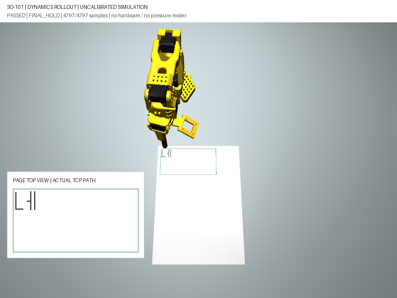
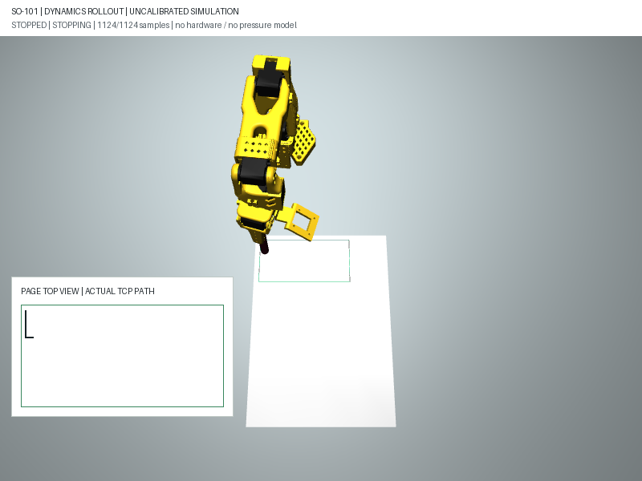

# M1: 가상 모터 동역학 추종·유지 중지 시험

착수 / 시험 / 최종 갱신: **2026-10-07 (KST)**. 상태: **기본 가상 조건 검증, M1 전체 진행 중**.

**이번 목표:** 계산한 자세를 매번 설정하는 재생이 아니라, MuJoCo 가상 모터가
시간 단계별로 참조 경로를 따라가는지 검사한다. 실물 모터나 필압을 검증하지 않는다.

## 구동 방식과 가정

1. [전체 기구학 사전검사](transit.md)를 통과해야 한다. 필기 구간만 통과한 경로는 시작하지 않는다.
2. 설정된 가상 공중 대기 관절로 **한 번만 초기화**하고 초기 속도는 0에서 시작한다.
3. 모터 목표 `data.ctrl`을 지정하고 5ms마다 `mj_step`으로 물리 상태를 적분한다.
   진행 중 `qpos`를 목표 관절로 복사하거나 중지 시 `qvel`을 0으로 덮어쓰지 않는다.
4. 적분 후 `mj_forward`로 현재 상태의 형상·접촉을 갱신하고 매 스텝을 검사한다.

이 방식은 MuJoCo의 [시뮬레이션 루프](https://mujoco.readthedocs.io/en/stable/programming/simulation.html#simulation-loop)를 사용한다.
모터는 모델에 있는 [position actuator](https://mujoco.readthedocs.io/en/stable/XMLreference.html#actuator-position)다.

| 항목 | 사용한 가상 조건 | 해석 |
| --- | --- | --- |
| 엔진 | 설치된 MuJoCo 3.11.0, implicitfast, 5ms | 실행 보고서에 버전·옵션 기록 |
| 중력 | `[0,0,-9.81]` m/s² | 끄거나 중력 보상 힘을 추가하지 않음 |
| 모터 kp / kv | 기존 모델 998.22 / 2.731 | 실제 서보 게인과 1:1 대응하지 않는 모델 값 |
| 힘 제한 | 기존 모델 6개 모터 각각 ±2.94 모델 단위 | 실물의 측정 토크나 안전한 필압이 아님 |
| 펜 | 기존 무질량 강체 프록시, 가상 60mm 오프셋 | 실제 질량·탄성·파지력·잉크 모델 없음 |
| 시간표 | 기존 기구학 시간표의 **2배** | 과속 거부 후 감속한 조건, 임의 가속은 허용하지 않음 |
| 초기/마지막 유지 | 0.5초 / 0.3초 | 속도가 연속 0.1초 안정 기준을 만족해야 함 |

기존 로봇 모델 파일은 수정하지 않았다. 모델의 게인·힘 제한을 높여 통과시키지 않았다.
실물 장착값을 알아내거나 로봇으로 이식하는 작업은 이번 범위가 아니다.

## 검사 기준

설정: [virtual_mount.json](../../kwon_lab/writing/config/virtual_mount.json)의 `dynamics`.

| 검사 | 개발용 기준 | 의미 |
| --- | --- | --- |
| TCP 모터 추종 오차 | 1mm 이하 | 적분된 TCP와 같은 시각의 참조 관절에서 계산한 TCP의 차이 |
| 종이 목표 대비 전체 오차 | 1.75mm 이하 | 기존 기구학 0.75mm + 동역학 추종 1mm의 별도 합산 기준 |
| 관절 추종 오차 | 0.02rad 이하 | 그리퍼 포함 실제 가상 관절과 해당 시각 참조 관절의 차이 |
| 펜 축 방향 | 3도 이하 | 종이 윗면 수직의 반대 방향과 비교 |
| 관절 속도 | 0.75rad/s 이하 | 매 스텝의 `qvel`, 그리퍼 포함 |
| 붓끝 속도 | 30mm/s 이하 | Jacobian×qvel의 순간 값과 스텝 사이 평균 속도 중 큰 값 |
| 공중 이동 | TCP 높이 12mm 이상 | 접근 내림/마지막 점 수직 올림 연결에는 8−1.75=6.25mm 적용 |
| 충돌·영역·한계 | 매 스텝 거부 검사 | 기존 강체 충돌 기준 재사용; 실제 접촉·필압 기준 아님 |
| 엔진 상태 | NaN/무한대·시간 초기화·수치 경고 거부 | 비정상 물리 계산을 완료로 기록하지 않음 |
| 물리 스텝 예산 | 최대 40,000개 | 초기 유지·진행·마지막 유지·중지 과정 모두 포함 |

**기구학 오차 기준 0.75mm는 그대로다.** 동역학 오차는 별도 1mm 기준이며
전체 종이 목표 오차를 이 두 값의 합으로 구분해 기록한다. 이는 실물 가독성의 합격 기준이 아니다.
기준 초과 시 시뮬레이션 적분을 즉시 중단하고 부분 진단을 남긴다. 실물 비상정지를 보장하지 않는다.
스텝 사이 연속 시간 전체의 안전·최대 속도를 증명하는 검사도 아니다.

## 2026-10-07 전체 경로 결과

| 시험 | 물리 스텝 수 | 최대 TCP 추종 오차 | 최대 종이 목표 오차 | 최대 붓끝 속도 | 적분한 가상 시간 |
| --- | --- | --- | --- | --- | --- |
| 직선 | 1,937 | 0.210mm 미만 | 0.593mm 미만 | 21.89mm/s 미만 | 9.685초 |
| 네모 | 3,063 | 0.447mm 미만 | 0.866mm 미만 | 25.59mm/s 미만 | 15.315초 |
| `네` 28mm | 4,797 | 0.450mm 미만 | 0.853mm 미만 | 23.75mm/s 미만 | 23.985초 |
| `가` 24mm | 3,381 | 0.449mm 미만 | 0.850mm 미만 | 22.44mm/s 미만 | 16.905초 |
| `한` 24mm | 5,311 | 0.452mm 미만 | 0.959mm 미만 | 23.78mm/s 미만 | 26.555초 |
| `글` 24mm | 4,290 | 0.451mm 미만 | 0.842mm 미만 | 23.47mm/s 미만 | 21.450초 |
| `안녕하세요.` 18mm | 20,044 | 0.453mm 미만 | 0.995mm 미만 | 25.41mm/s 미만 | 100.220초 |

판정: **기본 감속 조건의 가상 7종 경로 모두 통과**. 시간은 초기/마지막 유지를
포함한 MuJoCo 적분 시간이지 실행에 걸린 CPU 시간·GIF 길이·실물 필기 시간이 아니다.
모터 구동 상태가 참조 관절과 다르고 속도도 0이 아니므로 목표 자세 복사 재생과 구분한다.
[결과·모델·조건 JSON](assets/2026-10-07-m1-dynamics-summary.json).



헤더 `DYNAMICS ROLLOUT`은 물리 적분에서 기록한 실제 가상 관절 상태를 재생한다는 뜻이다.
그리퍼도 기록된 상태를 표시하며 목표값으로 바꾸지 않는다. 검은 선과 확대 보기는
기록된 TCP 경로다. 종이에 잉크가 묻거나 붓 탄성이 검증됐다는 뜻은 아니다.
GIF는 최대 48프레임을 고정 속도로 표시하므로 위 시간대로 재생되지 않는다.

## 실패와 중지 시험

**원래 시간표 실패:** `time_scale=1`로 `네`를 실행하면 2.730초의 물리 스텝에서
붓끝 속도가 약 **34.18mm/s**로 30mm/s 기준을 넘어 `actual_tip_overspeed`로 거부됐다.
속도·오차 기준을 넓히지 않고 시간표를 2배로 늘렸다.
[원래 속도 거부 JSON](assets/2026-10-07-m1-dynamics-original-speed.json).

**유지 중지 방식:** 요청 순간의 실제 가상 팔 관절을 목표로 고정한다. 미래 필기
목표를 더 보내거나 속도를 강제로 지우지 않고 계속 물리 적분하며 감속을 검사한다.
그리퍼는 펜 파지 목표를 유지한다. 종이에서 자동으로 펜을 들어올리는 기능은 아니다.
속도 ≤0.02rad/s·붓끝 ≤2mm/s를 **연속 0.1초** 만족해야 안정 상태로 판정한다.
1초 내 안정되지 않거나 중지 후 TCP 이동이 2mm를 넘으면 실패로 기록한다.

| 중지 조건 | 결과 |
| --- | --- |
| 경로 진행 5초 시점 요청 | `stopped`, 약 0.120초 뒤 안정화, 최대 추가 TCP 이동 약 0.065mm |
| 경로 진행 0초 시점 요청 | 필기 획 없이 유지 중지, 안정화 확인 |
| 중지 제한 시간 0.1초 | 안정 조건을 만족할 시간이 부족해 `stop_not_settled`로 거부 |
| 중지 이동 한도 0.001mm | `stop_displacement_exceeded`로 거부 |
| 모터 힘 제한을 테스트에서 1%로 축소 | 추종/속도 감시로 거부, 정상 성공으로 처리하지 않음 |
| 필기 구간만 통과 또는 사전검사 실패 | 물리 스텝을 실행하지 않음 |
| 비정상 수치·엔진 경고·예산 초과 | 거부, 부분 진단만 유지 |
| Ctrl+C / KeyboardInterrupt | 시뮬레이션 즉시 중단, 안정화된 유지 중지 성공으로 처리하지 않음 |

[유지 중지 결과 JSON](assets/2026-10-07-m1-dynamics-stop-summary.json).



정상 완료만 `status=passed`, `trajectory_complete=true`, `dynamics_validated=true`다.
유지 중지 시험 통과는 `status=stopped`, `stop_test_passed=true`, 전체 완료와 동역학
전체 경로 검증은 false다. 두 경우 모두 `physical_dynamics_validated=false`,
`pressure_validated=false`, `motion_authorized=false`, `joint_command_stream_available=false`다.

## 재현과 남은 단계

```powershell
# 7종의 가상 모터 동역학 검사
& '.\.venv\Scripts\python.exe' -X utf8 kwon_lab/tools/writing_simulation.py `
  --dynamics --suite --config kwon_lab/writing/config/virtual_mount.json `
  --output outputs/writing/m1-dynamics-review

# 네의 실제 가상 모터 상태 PNG/GIF
& '.\.venv\Scripts\python.exe' -X utf8 kwon_lab/tools/writing_simulation.py `
  --dynamics --text '네' --render --output outputs/writing/m1-dynamics-call

# 유지 중지 시험: Python 종료 코드 130, 보고서 status=stopped
& '.\.venv\Scripts\python.exe' -X utf8 kwon_lab/tools/writing_simulation.py `
  --dynamics --stop-after-s 5 --render --output outputs/writing/m1-dynamics-stop

# 실패 대조: 원래 시간표, Python 종료 코드 2
& '.\.venv\Scripts\python.exe' -X utf8 kwon_lab/tools/writing_simulation.py `
  --dynamics --time-scale 1 --output outputs/writing/m1-original-speed

# 회귀 검사
& '.\.venv\Scripts\python.exe' -X utf8 -m unittest discover -s tests -p 'test_writing*.py' -v
```

자동 테스트: 기존 59개 + 동역학 18개 = **77/77 통과**. 정상 7종, 실제 적분·시간,
원래 속도 거부, 약한 모터, 중지·실패·경고·CLI·설정 회귀를 포함한다.
상세 상태는 `report.json`, 작은 요약은 `summary.json`에 저장한다. 채팅 UI는 아직 2D 그대로다.

M0 사람 가독성 검수, 다른 가상 장착·종이 조건, M2 실행 관리·기록 연계가 남아 있다.
실물 전원/현재 자세에서 대기 자세로 이동, 실제 모터의 보정·오차·정지와
펜 질량·탄성·필압·반복 필기 시험은 장비 연결 후 따로 수행해야 한다.
**M1 전체 완료가 아니다.** 개발 중에는 로컬 미커밋·미푸시로 보관했으며,
2026-10-07 사용자 당일 마감·푸시 승인으로 현재 브랜치에 일괄 게시한다.
[마감 요약과 속도 개선 과제](README.md#2026-10-07-당일-마감과-재개-지점).

코드: [동역학 실행기](../../kwon_lab/writing/dynamics.py),
[CLI](../../kwon_lab/tools/writing_simulation.py), [검사](../../tests/test_writing_dynamics.py).
