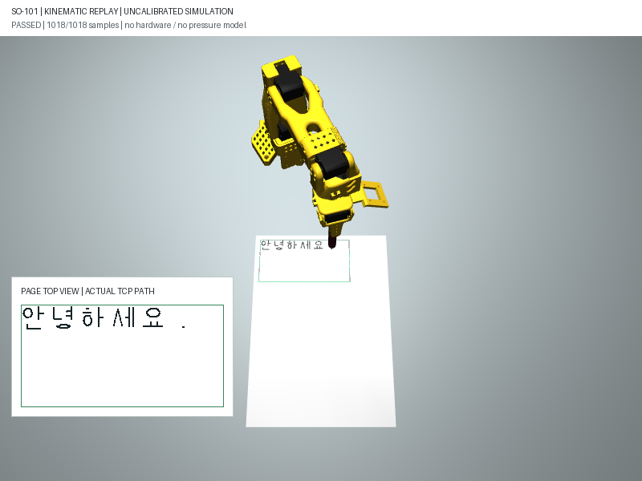

# M1: 펜 끝 기준 시뮬레이션 사전검사

착수 / 최종 갱신: **2026-10-07 (KST)**. 상태: **M1 진행 중, 기구학 사전검사 구현·검증**.

**로봇 없이 한글 획을 붓끝 기준 관절 경로로 계산하고, 위치·수직 방향·충돌·
연속성을 검사한다. 실물 모터 명령은 생성하거나 보내지 않는다.**

현재 CLI는 가상 대기 자세의 접근·필기·이탈·복귀까지 검사한다.
접근·복귀 단계는 [2026-10-07 기록](transit.md): 당시 자동 테스트 **59/59**, 기본 7종 전체 경로 통과.
이후 `--dynamics`로 [가상 모터 동역학·중지 검증](dynamics.md)을 추가했으며 현재 테스트는 **77/77**이다.
아래 방향 수정 단계의 샘플 수·44개 테스트 기록은 **필기 구간만 검사하던 이전 이력**이다.

## 이번에 구현한 범위

| 항목 | 구현과 검증 | 남은 한계 |
| --- | --- | --- |
| SO-101 모델 | 기존 Menagerie SO-101 모델·충돌 형상 재사용 | 실물 장비의 관절 영점·범위 미검증 |
| 가상 펜 | 그리퍼 로컬 좌표에 붓끝·축·몸통·펜촉 추가 | 강체 프록시, 실제 장착·미끄러짐·붓 변형 모델 아님 |
| 종이 | A4 평면과 종이 mm -> 로봇 모델 m 변환 | 가상 위치, 실제 종이 보정 아님 |
| 펜 끝 IK | MuJoCo 붓끝 Jacobian, 위치와 축 방향을 함께 계산 | 유한한 초기값·반복 횟수, 비수렴은 불가능의 수학적 증명 아님 |
| 경로 검사 | 지정된 가상 대기 자세의 접근·필기·이탈·복귀, 1mm 이하 샘플링 | 실물 전원/현재 자세에서 가상 대기 자세로 가는 경로는 미검증 |
| 중간 자세 검사 | 관절 보간의 25%·50%·75%에서도 오차·충돌·영역 검사 | 샘플 기반 검사이며 연속 구간 전체의 안전 증명이 아님 |
| 연속성·속도 | 관절 점프 제한과 가상 시간 배치 | 계산된 속도 제한이지 실제 서보 추종 성능이 아님 |
| 거부·중지 | 비수렴, 충돌, 영역 초과, 관절 점프, 중지, 점 수 초과 | M2의 비동기 실행 관리·영구 로그와는 별도 |
| 재생 | MuJoCo 3D PNG/GIF와 계산된 붓끝 경로 | 관절 자세 재생, `mj_step` 동역학 rollout 아님 |


초록 테두리는 후보 작업 영역이며 모든 점이 검증된 영역이라는 뜻은 아니다.
검은 획은 계산된 붓끝 경로 표시로, 잉크 접촉이나 사람의 판독 결과가 아니다.
왼쪽 아래는 동일한 **실제 계산 TCP**를 종이 좌표로 역변환한 확대 보기다.
문자 폰트나 원래 목표 획으로 대체한 이미지가 아니며, 팔에 가려진 획을 확인하기 위한 진단 표시다.

## 가상 장착 프로필

설정: [virtual_mount.json](../../kwon_lab/writing/config/virtual_mount.json).
붓펜 명목 규격과 실제 장착값은 [장착 계획](pen-mounting.md)에서 따로 관리한다.

| 설정 | 가상 값 | 의미 |
| --- | --- | --- |
| 프로필 | `virtual-x-axis-60mm-v1` | 미보정·시뮬레이션 전용 |
| 붓끝 오프셋 | 그리퍼 기준 `[0.060, 0, 0]` m | 실측값 아님, 몸통 중간 파지의 확정값도 아님 |
| 펜 축 | 그리퍼 기준 `[1, 0, 0]` | 펜 몸통에서 붓끝으로 향하는 방향 |
| 가상 몸통 길이 | 145mm | 닫힌 제품 길이 170.5mm를 복사한 것이 아닌 프록시 형상 |
| 가상 몸통 반지름 | 6.25mm | 공식 외형 폭 12.5mm를 참고한 프록시, 파지 부위 실측 아님 |
| 펜촉 길이·반지름 | 10mm·0.5mm | 미측정 가정, 실제 획 굵기 아님 |
| 종이 원점 | `[0.200, -0.040, 0.005]` m | 방향 수정 후 모델 기준 가상 배치 |
| 종이 축 | 오른쪽 `[0,1,0]`, 아래쪽 `[1,0,0]` | 윗면 법선은 `-cross(오른쪽, 아래쪽) = [0,0,1]`, 펜 목표 방향은 반대 법선 |
| 후보 영역 | x 8~150mm, y 8~80mm | A4 전체를 사용하지 않음, 경로별 추가 검사 필요 |
| 허용 오차 | 위치 0.75mm, 축 각도 3도 | 개발용 사전 기준, 실물 가독성 기준 아님 |
| 경로·관절 제한 | 1mm 샘플링, 관절 차이 0.04rad 이하 | 중간 자세도 검사 |
| 시간 배치 제한 | 붓끝 20mm/s, 관절 0.5rad/s | 실제 시간이나 보장 속도 아님 |

마운트는 강체 부착으로 가정한다. 부착된 펜과 그리퍼 하위 몸체 사이 접촉은
의도적인 장착 겹침으로 제외한다. 펜과 다른 팔 부품·종이·테이블의 충돌은 검사한다.
일반 침투는 0.05mm를 넘으면 거부하며, 펜촉과 종이의 접촉은 수치 오차용
0.2mm 한도만 허용한다. 이 값은 실제 눌림량이나 필압 설정이 아니다.

## 2026-10-07 방향 수정 단계 결과: 필기 구간만 검사

| 시험 | 글자 크기 | 진단 샘플 수 | 최대 위치 오차 | 최대 축 각도 오차 | 판정 |
| --- | --- | --- | --- | --- | --- |
| 직선 | 도형 | 46 | 0.733mm | 0.158도 미만 | 기구학 사전검사 통과 |
| 네모 | 도형 | 114 | 0.733mm | 0.158도 미만 | 기구학 사전검사 통과 |
| `네` | 28mm | 192 | 0.433mm | 0.174도 | 기구학 사전검사 통과 |
| `가` | 24mm | 131 | 0.714mm 미만 | 0.168도 미만 | 기구학 사전검사 통과 |
| `한` | 24mm | 245 | 0.750mm 미만 | 0.125도 미만 | 기구학 사전검사 통과 |
| `글` | 24mm | 174 | 0.433mm | 0.163도 미만 | 기구학 사전검사 통과 |
| `안녕하세요.` | 18mm | 1,018 | 0.750mm 미만 | 0.174도 | 기구학 사전검사 통과 |

위 오차는 IK 샘플 지점 기준이며 보간 중간점도 허용 범위 안인지 별도로 검사했다.
**7개 경로의 통과는 실제 필기 7회 성공이나 A4 전체 도달 가능 판정이 아니다.**
위 표는 방향 수정 후 재검사한 결과다.
요약 데이터: [2026-10-07 방향 수정 후 사전검사 결과](assets/2026-10-07-m1-direction-fix-summary.json).



**실패와 수정:** 초기 가상 오프셋 80mm에서는 `네`의 시작점 위치 오차가 약
2.19mm로 기준을 넘었다. 허용 오차를 넓히지 않고 오프셋 60mm라는 다른 가정을
시험했다. 80mm 조건은 새 사전검사에서 계속 거부되는지 회귀 검사한다.
이는 60mm가 실제 장착의 정답이거나 80mm가 모든 자세에서 불가능하다는 뜻이 아니다.

**당시 자동 검사:** 기존 19개 + 시뮬레이션 25개, 총 **44개**. 로컬 펜 변환과
Jacobian 유한차분, 반대 방향 오인 방지, 7종 경로, 장착 변경, 영역·충돌·관절 점프,
중지·점 수 제한, 설정 검증과 기존 호출 응답/API 회귀를 포함한다.
종이 윗면·단위 변환·카메라의 오른쪽/아래쪽 투영·정상 회전 행렬 검사도 포함한다.

## 2026-10-07 글씨 방향 오류 수정

**발견:** 사용자가 최초 3D 재생의 글씨 방향이 이상하다고 지적했다.
최초 기구학 검사는 좌표 왕복과 관절 오차를 통과했지만, 화면과 종이 윗면에서
글씨를 바르게 읽는 방향인지는 검증하지 않았다. 그 결과를 필기 성공으로 볼 수 없다.

**원인:** 종이는 왼쪽 위 원점에서 x는 오른쪽, y는 아래쪽, z는 종이 바깥으로
정의했다. 이 좌표는 왼손 좌표계인데, 윗면 법선을 `cross(x, y)`로 계산해
오른손 좌표계로 취급하면서 위에서 보는 글씨가 반전됐다. 고정 카메라의
비스듬한 시점과 로봇 그림자도 방향과 획 판독을 어렵게 했다.

**수정:** 윗면 법선을 `-cross(x, y)`로 변경하고 기본 x축·원점을 함께 조정했다.
종이의 좌표 변환은 반사 성분을 포함하므로 MuJoCo 형상용 quaternion에 직접
넣지 않고, 별도의 오른손 회전 행렬 `[x, -y, normal]`을 사용한다.
카메라도 종이의 오른쪽이 화면 오른쪽, 아래쪽이 화면 아래쪽이 되도록 배치했다.
로봇과 종이를 함께 보이게 조정하고 그림자를 숨기며 실제 TCP 경로 확대 보기를 추가했다.

**재검증:** 자동 테스트 44/44, 가상 7종 경로 모두 통과. `네`·고정 문장의
PNG/GIF를 다시 생성해 시각적으로 확인했다. 실물 장착·필압·사용자 가독성 검수는 여전히 미완료다.
첫 전체 테스트의 기존 HTTP 검사는 Windows 연결 중단 오류가 한 번 발생했으나,
HTTP 코드는 수정하지 않았으며 재실행에서는 모두 통과했다.
보고서 `format_version=2`와 `paper_coordinate_convention`으로 수정된 좌표 규칙을 구분한다.
이전 v1 보고서는 새 재생에 사용하지 않고 사전검사를 다시 실행해야 한다.

**수정 전 자료 보존:** [최초 네 재생](assets/2026-10-07-m1-call.png),
[최초 문장 재생](assets/2026-10-07-m1-sentence.png),
[최초 결과 JSON](assets/2026-10-07-m1-summary.json)은 방향 오류가 있던 개발 이력이다.
현재 검증 증거로 사용하지 않는다. 코드·새 증거·날짜 기록은 로컬 변경이며 커밋·푸시하지 않았다.

## 재현 명령

저장소 루트의 PowerShell에서 실행한다. 기존 `.venv`의 MuJoCo·NumPy·Pillow를 사용한다.

```powershell
# 7종 경로와 결과 JSON
& '.\.venv\Scripts\python.exe' -X utf8 kwon_lab/tools/writing_simulation.py `
  --suite --config kwon_lab/writing/config/virtual_mount.json `
  --output outputs/writing/m1-review

# 네의 관절 자세 재생: report.json, replay.png, replay.gif
& '.\.venv\Scripts\python.exe' -X utf8 kwon_lab/tools/writing_simulation.py `
  --text '네' --render --output outputs/writing/m1-call

# 과거 필기 구간 검사 재현: 접근·이탈·복귀는 검사하지 않음
& '.\.venv\Scripts\python.exe' -X utf8 kwon_lab/tools/writing_simulation.py `
  --text '네' --writing-only --output outputs/writing/m1-writing-only

# 수정 가능한 가상 프로필 예시 출력
& '.\.venv\Scripts\python.exe' -X utf8 kwon_lab/tools/writing_simulation.py `
  --write-example-config outputs/writing/virtual-mount.json

# 필기 관련 회귀 검사
& '.\.venv\Scripts\python.exe' -X utf8 -m unittest discover -s tests -p 'test_writing*.py' -v
```

사용자 프로필은 `--config`로 지정한다. 장착값·종이 위치를 바꾸면 같은 글자라도
다시 검사하며, 설정에 `calibrated=true` 또는 `simulation_only=false`를 넣으면 거부한다.
CLI는 통과 시 0, 경로 거부 시 2를 반환한다. 렌더링은 OpenGL이 필요하지만
사전검사와 자동 테스트에는 이미지 렌더링이 필요 없다.
기본 CLI는 `scope=full_cycle`이며 `--writing-only`는 이전 구간 검사다.
Python API의 `initial_q`는 여전히 필기 구간 전용 IK 초기값으로 실제 시작 자세가 아니다.
전체 경로에는 `transit=TransitSettings()`를 지정하며 두 시작 설정을 함께 사용하지 않는다.

실패·중지 보고서의 `samples`는 진단용 부분 결과다. 실행 가능한 명령열이 아니며
기구학 사전검사 통과 보고서도 `motion_authorized=false`, `joint_command_stream_available=false`,
`physical_calibration_required=true`, `dynamics_validated=false`를 유지한다.
재생 GIF는 최대 48프레임의 고정 속도 시각화로 실제 소요 시간을 표시하지 않는다.
기존 채팅 화면은 계속 2D 미리보기이며 이번 CLI와 아직 연결하지 않았다.

## M1 완료 전 남은 검증

- [x] 지정된 가상 공중 대기 자세의 접근·이탈·정확한 관절 복귀 경로 검사.
- [ ] 실물 전원/현재 자세에서 보정된 대기 자세에 도달하는 경로(실물 이식 시 필수).
- [x] 기본 가상 프로필의 시간 단계·액추에이터를 사용하는 동역학 추종과 유지 중지 시험.
- [ ] 실제 모터·펜 질량·탄성·필압·정지 성능 검증(장비 연결 후 별도).
- [ ] 다른 종이 배치·장착 가정과 더 넓은 경로의 도달영역·충돌 평가.
- [ ] M0 사용자 가독성 검수와 M2 작업 관리·영구 기록 연계.

M3~M6의 실물 장착·접촉·반복 필기 시험은 여전히 장비 대기이며 0회다.
실물 이식 시에는 측정값과 실제 작업 범위를 바탕으로 다시 검증해야 한다.

관련 코드: [기구학·사전검사](../../kwon_lab/writing/simulation.py),
[재생 렌더러](../../kwon_lab/writing/simulation_preview.py),
[CLI](../../kwon_lab/tools/writing_simulation.py),
[검사](../../tests/test_writing_simulation.py).
API 참고: [MuJoCo Jacobian 함수](https://mujoco.readthedocs.io/en/stable/APIreference/APIfunctions.html#mj-jacsite),
[MuJoCo Python 모델·렌더러](https://mujoco.readthedocs.io/en/stable/python.html).
