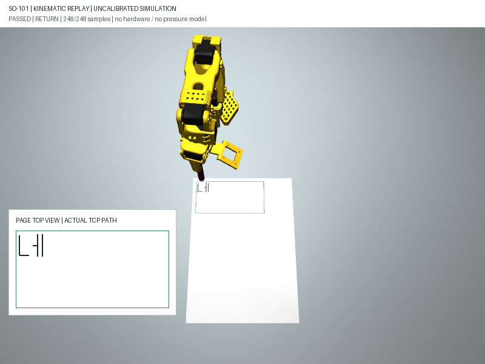
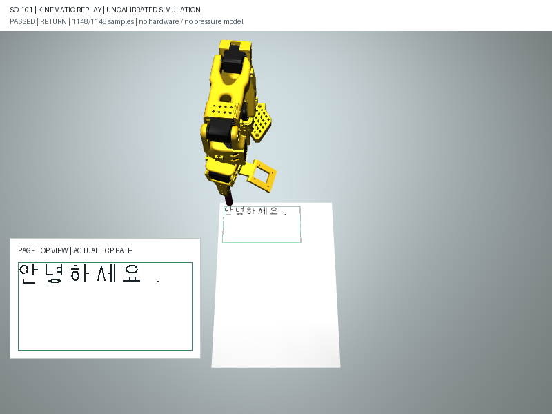

# M1: 공중 대기 자세의 접근·필기·이탈·복귀

착수 / 시험 / 최종 갱신: **2026-10-07 (KST)**. 상태: **기구학 경로 검사 구현·검증, M1 전체 진행 중**.

**목표:** 첫 필기점에 바로 자세를 설정하는 이전 재생을 확장해, 지정된 가상
대기 자세에서 접근하고 필기 후 같은 관절 자세로 복귀하는 전체 경로를 검사한다.
실물 로봇 연결·모터 명령·AI 답변·음성 인식은 추가하지 않았다.

## 경로와 검사

| 순서 | 보고서 단계 | 동작 | 검사 |
| --- | --- | --- | --- |
| 1 | `initialization` | 설정된 공중 대기 관절로 시뮬레이션 초기화 | 관절 범위, 수직 축, 작업 영역, 높이, 충돌 |
| 2 | `approach` | 대기 위치의 이동 높이 정렬→첫 획 위 공중 이동→8mm로 내림 | IK·중간 자세·공중 이동 높이·연속성·충돌 |
| 3 | `writing` | 기존 획의 올림·내림·필기 | 기존 위치·각도·영역·충돌 검사 |
| 4 | `departure` | 마지막 획 위에서 이탈→공중 대기 위치로 이동 | 필기 가능한 점이라도 이탈 불가능하면 거부 |
| 5 | `return` | 대기 IK 결과에서 정확한 설정 관절값으로 최종 정렬 | 최종 짧은 관절 구간도 동일하게 검사 |

모든 관절 구간의 25%·50%·75% 지점과 끝점을 검사한다. 충돌 검사의 형상과
수치 침투 한도는 [시뮬레이션 기록](simulation.md)의 개발용 강체 모델을 그대로 사용한다.
목표점은 1mm 이하로 샘플링하며 관절 변화는 0.04rad 이하다.
가상 시간은 관절 변화·목표점 거리뿐 아니라 **계산된 TCP의 보간 중간 이동량**도
반영해 샘플 기준 붓끝 20mm/s·관절 0.5rad/s 제한을 만족하게 배치한다.
연속 시간 전체의 속도·가속도·안전을 증명한 것이 아니며 액추에이터 추종 검증도 아니다.

## 가상 대기 설정

설정 파일: [virtual_mount.json](../../kwon_lab/writing/config/virtual_mount.json)의 `transit`.

| 항목 | 값 | 주의 |
| --- | --- | --- |
| 대기 관절 `ready_q_rad` | `[0.0992351067,-0.2717824768,0.2524989785,1.5859414678,-0.1334262657]` rad | 모델의 가상 60mm 장착에서 구한 자세, 실측·실물 home 아님 |
| 관절 순서 | shoulder_pan, shoulder_lift, elbow_flex, wrist_flex, wrist_roll | 그리퍼는 기존 0.1rad 고정 |
| 대기 TCP의 종이 좌표 | 약 `[20.150,12.318,16.178]` mm | 정밀한 종이/펜 보정값이 아니라 모델 계산 결과 |
| 공중 이동 목표 높이 | 16mm, 대기 높이가 더 높으면 그 높이 사용 | 이번 기본 설정의 실제 목표는 약 16.178mm |
| 공중 이동의 최소 TCP 높이 | 12mm | 종이 윗면 기준 가상 검사값, 실물 안전 거리 아님 |
| 첫 점 진입·마지막 점 이탈 연결 높이 | 기존 펜 올림 8mm | 수직 연결 구간은 오차를 포함한 7.25mm 이상인지 검사 |

대기 TCP도 후보 작업 영역 안에 있어야 한다. 넓은 영역 밖의 임의 대기 자세를
찾거나 장애물을 피하는 경로 탐색기는 아니다. 장착이나 종이 배치를 바꾸면
대기 자세부터 다시 검사하고 불합격이면 전체 작업을 거부한다.

**중요:** 시뮬레이션의 시작 관절은 설정값으로 초기화한다. 실제 로봇이 전원을
켜거나 임의 자세에 있을 때 이 자세로 이동하는 경로는 아직 검사하지 않았다.
실물에 이 관절값을 복사해 실행하면 안 된다.

## 2026-10-07 시험 결과

| 시험 | 전체 진단 샘플 | 최대 TCP 위치 오차 | 최대 축 각도 오차 | 배치한 가상 시간 | 판정 |
| --- | --- | --- | --- | --- | --- |
| 직선 | 97 | 0.433mm 미만 | 0.238도 미만 | 4.44초 | 전체 경로 통과 |
| 네모 | 154 | 0.436mm 미만 | 0.238도 미만 | 7.26초 | 전체 경로 통과 |
| `네` 28mm | 248 | 0.433mm 미만 | 0.238도 미만 | 11.59초 | 전체 경로 통과 |
| `가` 24mm | 176 | 0.433mm 미만 | 0.238도 미만 | 8.05초 | 전체 경로 통과 |
| `한` 24mm | 295 | 0.750mm 미만 | 0.238도 미만 | 12.88초 | 전체 경로 통과 |
| `글` 24mm | 224 | 0.433mm 미만 | 0.238도 미만 | 10.32초 | 전체 경로 통과 |
| `안녕하세요.` 18mm | 1,148 | 0.750mm 미만 | 0.238도 미만 | 49.71초 | 전체 경로 통과 |

7종에서 공중 운반 구간의 TCP 최저 높이는 보간 검사점을 포함해 15.853mm 이상이었다.
낮추기·필기·마지막 점 수직 이탈에는 이 운반 구간 통계를 적용하지 않는다.
첫/끝 관절이 설정 대기값과 일치하며 접근·필기·이탈·복귀 전체 순서를 확인했다.
**이는 실물 필기 성공률·실제 시간·A4 전체 도달 가능 판정이 아니다.**
[전체 결과 JSON](assets/2026-10-07-m1-transit-summary.json).





## 실패·중지 시험

| 조건 | 확인된 결과 | 의미 |
| --- | --- | --- |
| 이동 높이 30mm | 접근 단계 IK 비수렴으로 거부 | 높이면 항상 더 좋은 경로가 되는 것은 아님; 허용 오차는 넓히지 않음 |
| 직선 `(12,12)→(140,40)mm` | 필기 구간은 통과, 전체 경로는 이탈 단계에서 IK 비수렴으로 거부 | 쓸 수 있다는 것만으로 끝내고 빠져나올 수 있다는 뜻은 아님 |
| 너무 낮은 초기 자세 | 초기 높이 검사 거부, 첫 점으로 순간 이동하지 않음 | 시작 자세도 필수 검사 |
| 초기 관절 한계·축 방향·충돌 오류 | 초기화 단계 거부 | 적합한 필기 경로라도 초기 상태가 불합격이면 시작하지 않음 |
| 접근·필기·이탈·복귀 중 사전검사 중지 요청 | `stopped`, 전체 완료 false | 계산 중단 시험이며 움직이는 실물의 정지 시험은 아님 |
| 같은 네 단계에서 점 수 예산 소진 | 해당 단계에서 거부, 부분 진단만 보존 | 부분 경로를 실행 가능한 작업으로 노출하지 않음 |

이탈 실패 직선은 약 16.178mm 목표 높이에서 위치 오차 약 1.304mm로 거부됐다.
이전 구간이 통과해 `approach_validated=true`여도 전체 상태가 거부되면 작업 통과가 아니다.
통과·실패·중지 모두 `motion_authorized=false`, `joint_command_stream_available=false`,
`physical_calibration_required=true`, `dynamics_validated=false`를 유지한다.

**자동 테스트:** 기존 44개 + 접근·복귀 15개 = **59/59 통과**.
7종 전체 경로, 정확한 시작/복귀, 중간 높이·충돌·속도, 초기 오류, 접근/이탈 실패,
단계별 중지/점 수 제한, Python API·CLI 구분과 설정 검증을 포함한다.

## 실행과 다음 단계

```powershell
# 기본은 접근·필기·이탈·복귀 전체 검사
& '.\.venv\Scripts\python.exe' -X utf8 kwon_lab/tools/writing_simulation.py `
  --suite --config kwon_lab/writing/config/virtual_mount.json `
  --output outputs/writing/m1-transit-review

# 네의 전체 경로 PNG/GIF
& '.\.venv\Scripts\python.exe' -X utf8 kwon_lab/tools/writing_simulation.py `
  --text '네' --render --output outputs/writing/m1-transit-call

# 과거 필기 구간만 검사하는 모드: 전체 작업 통과로 사용하지 않음
& '.\.venv\Scripts\python.exe' -X utf8 kwon_lab/tools/writing_simulation.py `
  --text '네' --writing-only --output outputs/writing/m1-writing-only

# 전체 회귀·실패·중지 시험
& '.\.venv\Scripts\python.exe' -X utf8 -m unittest discover -s tests -p 'test_writing*.py' -v
```

CLI는 기본 `scope=full_cycle`, `--writing-only`를 지정하면 `writing_only`다.
Python API는 호환성을 위해 `preflight(plan)`을 필기 구간 검사로 유지하고,
전체 경로는 `preflight(plan, transit=TransitSettings())`로 요청한다.
`initial_q`는 필기 구간 전용 IK 초기값이며 `transit`과 함께 지정하면 거부한다.

GIF는 여전히 최대 48프레임의 고정 속도 관절 자세 재생이다. 헤더에 검사 단계를
표시하고, 붓끝 경로는 실제 계산 TCP로 표시한다. 위 가상 시간대로 재생되는 영상이 아니다.
기존 채팅 앱은 2D 미리보기 그대로이고 이번 전체 검사와 아직 연결하지 않았다.

다음 핵심은 실제 시간 단계·액추에이터를 사용하는 **동역학 추종과 중지 시험**이다.
이후 같은 날짜의 사용자 승인으로 [가상 동역학 검증](dynamics.md)을 구현했으며
당시 다음 작업이었던 기본 프로필의 동역학·유지 중지 시험은 완료했다. 실제 모터 시험은 여전히 미완료다.
다른 장착/종이 조건 평가, M0 사람 검수와 M2 실행 관리 연계도 남아 있다.
**개발 시점에는 로컬 미커밋·미푸시로 보관했다.** 이후 2026-10-07 사용자 당일
마감·푸시 승인으로 현재 브랜치에 일괄 게시한다. [마감 기록](README.md#2026-10-07-당일-마감과-재개-지점).

코드: [사전검사](../../kwon_lab/writing/simulation.py),
[CLI](../../kwon_lab/tools/writing_simulation.py), [접근·복귀 테스트](../../tests/test_writing_transit.py).
